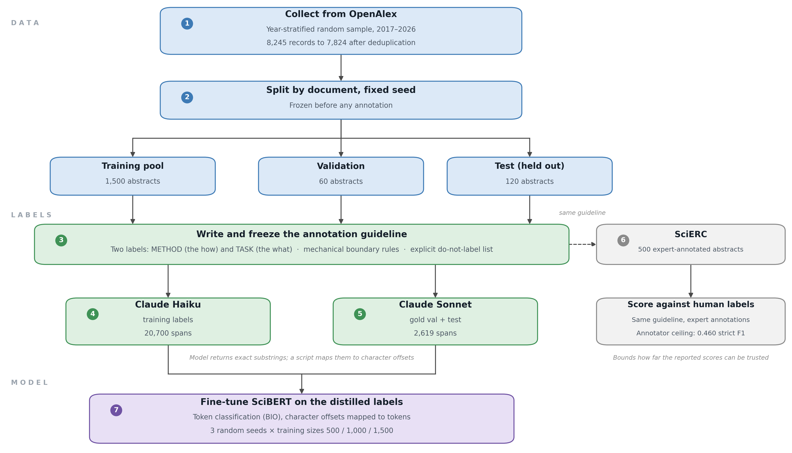
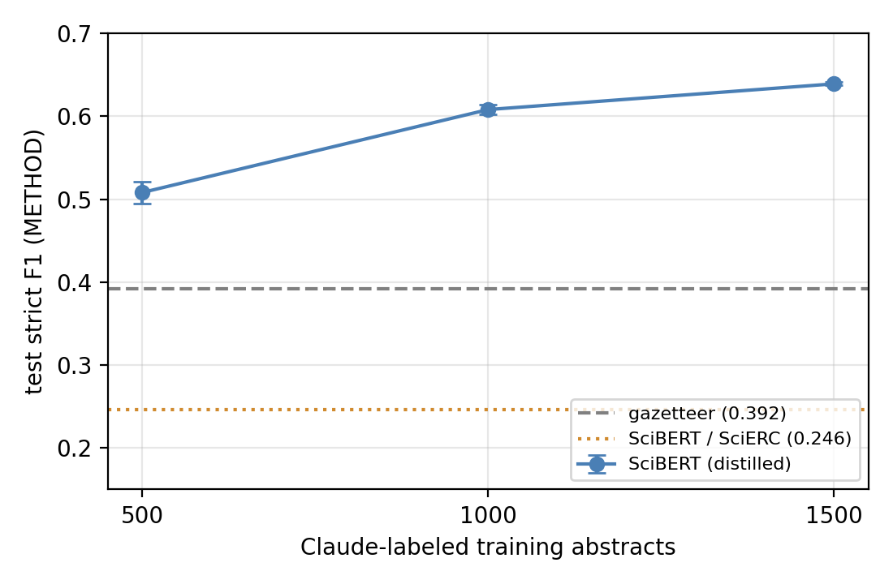

# Named Entity Recognition for Technology Terms

Extracting technology mentions from research paper titles and abstracts, labeled as **METHOD** (the how: models, architectures, algorithms) or **TASK** (the what: problems being solved).

Instead of hand-annotating training data, a large language model labels abstracts under a fixed written guideline, and a small SciBERT model is trained on those labels. Because the test labels also come from the language model, the annotator itself is scored against expert human labels on [SciERC](http://nlp.cs.washington.edu/sciIE/), which puts a stated ceiling on how far the results can be trusted.

This repository accompanies the paper *Exploring Methodologies to Extract Technology from Research Papers*.



## Results

METHOD extraction on the held-out test set (119 abstracts, 1,303 entities). Mean ± standard deviation over three seeds.

| System | Training data | Strict F1 | Partial F1 |
|---|---|---|---|
| Gazetteer | train surface forms | 0.392 | 0.614 |
| SciBERT | SciERC, 350 docs | 0.246 ± 0.018 | 0.586 ± 0.001 |
| SciBERT | distilled, 500 | 0.508 ± 0.013 | 0.725 ± 0.001 |
| SciBERT | distilled, 1,000 | 0.608 ± 0.006 | 0.777 ± 0.004 |
| SciBERT | distilled, 1,500 | **0.639 ± 0.002** | **0.790 ± 0.004** |

The annotator agrees with SciERC's expert labels at **0.460** strict F1 on METHOD. That figure is measured on a different corpus under a different scheme, so it bounds the table above rather than sitting on the same scale.



## Repository layout

```
collect_openalex.py      1. pull abstracts from OpenAlex, build canonical text
make_splits.py           2. freeze train / val / test splits before annotation
prep_kaggle.py           3. sample the training subset, stage files for Kaggle
annotate_with_claude.py  4. label abstracts with Claude (substrings -> offsets)
scierc.py                5. convert SciERC and score the annotator against it
train_ner.py             6. fine-tune SciBERT, entity-level evaluation
notebooks/               Kaggle notebook with the reported runs and outputs
data/                    Claude-annotated train, validation and test sets
figures/                 pipeline diagram and learning curve
```

## Setup

```bash
pip install -r requirements.txt
cp .env.example .env    # then fill in your keys, or export them in your shell
```

Two keys are needed: `ANTHROPIC_API_KEY` for annotation and `OPENALEX_API_KEY` for collection. Training needs neither.

## Reproducing

**Train and evaluate only.** The annotated data is included, so this needs just a GPU (a free Kaggle T4 is enough):

```bash
python train_ner.py --train data/train_annotated.jsonl \
                    --val   data/gold_val_annotated.jsonl \
                    --test  data/gold_test_annotated.jsonl \
                    --limit 1500 --seeds 3 --epochs 3
```

**Full pipeline from scratch:**

```bash
python collect_openalex.py --all                       # collect
python make_splits.py --corpus corpus.parquet --out-dir data
python annotate_with_claude.py --input data/gold_val.jsonl  --output data/gold_val_annotated.jsonl
python annotate_with_claude.py --input data/gold_test.jsonl --output data/gold_test_annotated.jsonl
python prep_kaggle.py --subset 1500                    # sample training pool
python annotate_with_claude.py --input data/train_pool_subset.jsonl --output data/train_annotated.jsonl
```

Set `MODEL` near the top of `annotate_with_claude.py` before each run. The paper used Claude Sonnet for the validation and test sets and the cheaper Claude Haiku for training, which cost roughly $15 for 1,500 abstracts. Annotation is resumable, so an interrupted run picks up where it stopped.

**SciERC ceiling:**

```bash
python scierc.py --prepare
python annotate_with_claude.py --input data/scierc_input.jsonl --output data/scierc_claude.jsonl
python scierc.py --score
```

Each script has fuller usage notes in its docstring.

## Data notes

`data/` contains only the Claude-annotated files produced by this project. Abstracts come from [OpenAlex](https://openalex.org). SciERC is not redistributed here; `scierc.py --prepare` downloads and converts it. Every character offset refers to the canonical text built once in `collect_openalex.py`, so that text must never be regenerated after annotation.
